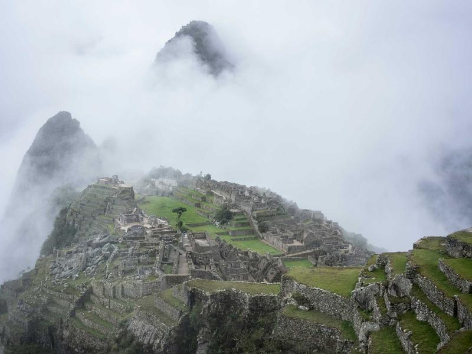
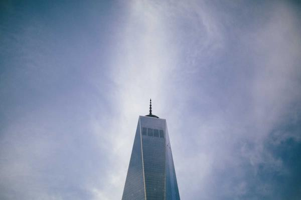

# Students Without Borders: The Quiet Diplomacy of Education

> **Category:** News Report | **Words:** ~600  
> **Cover:** 

---

NEW YORK — When Liu Fang arrived at Columbia University in the fall of 2019, she carried two suitcases, a family recipe for mapo tofu, and a deep uncertainty about whether Americans would accept her. Four years later, she holds a degree in public policy, a network of friends from twelve countries, and a conviction that the classroom remains the most effective diplomatic channel the two nations possess.

"I came expecting to be an outsider," she says over coffee in Morningside Heights. "What I found was that being Chinese was interesting, not isolating. My American classmates wanted to know about WeChat, about the college entrance exam, about whether my parents really only had one child. They were curious, not hostile."

Liu's experience reflects a pattern that persists despite the deterioration in official relations between Washington and Beijing. In the 2022-2023 academic year, nearly 290,000 Chinese students were enrolled at American universities, representing roughly one-third of all international students in the United States. The numbers have declined from their pre-pandemic peak, but the scale remains staggering — larger than the total student population of many countries.

These students are not merely consumers of American education; they are carriers of culture in both directions. They introduce their American peers to Lunar New Year, to hot pot, to a work ethic that reshapes the grading curve. And they return to China — or stay in the United States — carrying American habits of critical thinking, classroom debate, and the radical idea that it is acceptable to disagree with a professor.

"Every Chinese student who spends four years here is changed," says Dr. Jonathan Park, who studies educational migration at NYU. "And every American classroom with a significant Chinese presence is changed too. It is the largest people-to-people exchange in history, and it operates almost entirely below the radar of geopolitics."

The challenges are real. Visa restrictions have tightened. Some families now view the United States as a riskier destination and are shifting toward the UK, Canada, and Australia. And the experience is not universally positive — isolation, discrimination, and the sheer pressure of performing in a second language take their toll. But the aggregate effect remains: hundreds of thousands of young people each year who can say, truthfully, "I have a friend from the other side."

---

*Cover image: The campus as a meeting ground of civilizations.*
