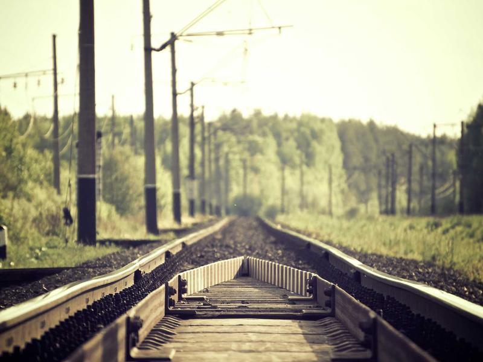

# Gothic Cathedrals: Engineering the Divine

> **Category:** Introduction | **Words:** ~700  
> **Cover:** 

---

In the spring of 1144, the choir of the Abbey Church of Saint-Denis, just north of Paris, was consecrated in a ceremony attended by the king of France. Those who entered that day saw something no European had ever seen: walls that seemed to dissolve into colored glass, arches that pointed heavenward like folded hands, and a space filled with light that felt less like architecture and more like a miracle. The Gothic cathedral had been born.

The secret was not magic but engineering — though for medieval builders, the line between the two was thin. Three technical innovations made Gothic possible. The **pointed arch**, borrowed from Islamic architecture encountered during the Crusades, distributed weight more efficiently than the round Roman arch, allowing builders to reach greater heights. The **ribbed vault** concentrated the roof's weight onto specific points rather than the entire wall. And the **flying buttress** — that graceful, skeletal exoskeleton on the outside of every Gothic church — carried the lateral thrust of the high stone vaults down to the ground, freeing the walls to become windows.

What happened next was a building boom unlike anything Europe had seen. In less than a century, dozens of cathedrals rose across France: Chartres, Reims, Amiens, Bourges, Beauvais. Each pushed the limits further. The nave of Amiens reached 42 meters — the height of a fourteen-story building, built with nothing but stone, timber, and human muscle. Beauvais aimed even higher and famously collapsed — twice — teaching a hard lesson about the difference between ambition and hubris.

The Gothic cathedral was more than a building; it was an encyclopedia in stone. In an age when most people could not read, the sculptures and stained-glass windows told the entire Christian story: creation, fall, redemption, judgment. Gargoyles guarded the edges, grotesque and half-animal, reminding the faithful of the demons waiting outside the church's protection. The labyrinth set into the floor of Chartres allowed pilgrims to make a symbolic journey to Jerusalem without leaving France.

And the light — the light was everything. Abbot Suger, the visionary behind Saint-Denis, wrote that the colored glass transformed the church into "a strange region of the universe which exists somewhere between the slime of earth and the purity of heaven." The windows were not decoration; they were the point.

Today, a thousand years after the first pointed arch was raised, Gothic cathedrals still draw millions of visitors. They remain among the tallest stone structures ever built. We have better tools now — steel, concrete, computer modeling — but we have not built anything that makes people feel quite the way Chartres does at sunset, when the western rose window catches fire and the whole building seems to float.

---

*Cover image: Light through stained glass — the soul of Gothic architecture.*
