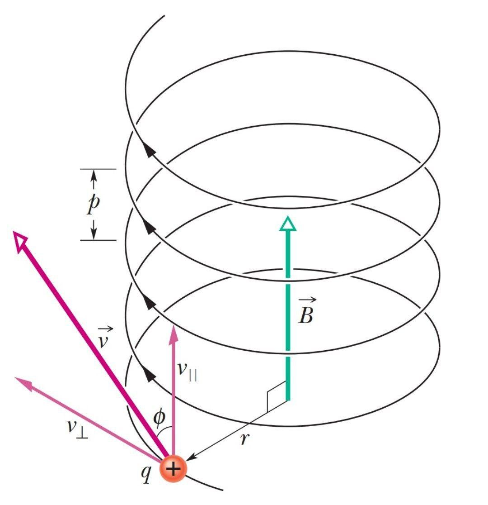

# Particle Movement in Magnetic Field

> **Category:** Overview | **Words:** ~850  
> **Cover:** 

---

In the magnetic field, a charged particle will exoerience an external force called the *Lorentz force*, which will alter its trajectory into circular motion.
The function of the Lorentz force is  $$  
                                      \vec{F} = q (\vec{v} \times \vec{B}) 
                                      $$

---

*Cover image: A striking architectural form, modern yet timeless.*
