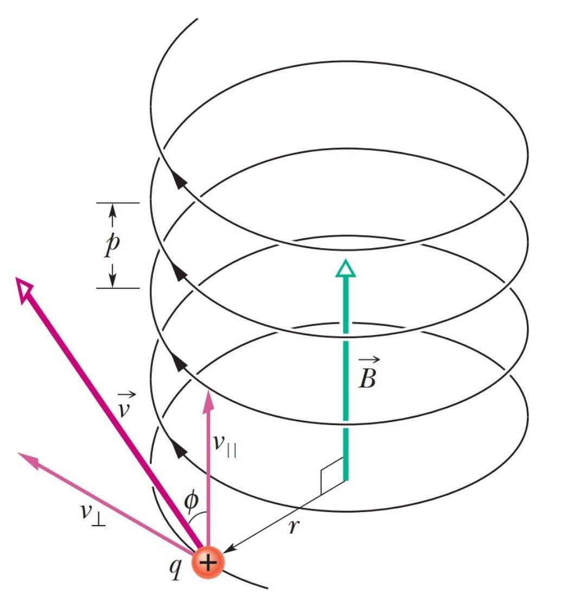

# Particle Movement in Magnetic Field

> **Category:** Overview | **Words:** ~850  
> **Cover:** 

---

In the magnetic field, a charged particle will experience an external force called the *Lorentz force*, which will alter its trajectory into a helix.
The function of the Lorentz force is:
$$\vec{F} = q (\vec{v} \times \vec{B})$$
where 
* $q$ is the charge of the particle
* $\vec{v}$ is the velocity of the particle
* $\vec{B}$ is the magnetic field
* $\vec{F}$ is the Lorentz force exerted on the particle

The initial velocity $\vec{v}_0$ can be seen as the vector sum of the velocities parallel to the magnetic field $\vec{v}_{\parallel}$ and perpendicular to the magnetic field $\vec{v}_{\perp}$.
The component velocity that is parallel to the magnetic field:
$$v_{\parallel} = v \cos\theta$$
Since it is parallel with the magnetic induction line, the component force is $q(v_{\parallel} \times B) = 0$, according to Newton's first law of motion, the particle maintains a constant linesar motion in the *z* direction.
The compoonent velocity that is perpendicular to the magnetic field:
$$v_{\perp} = v \sin\theta$$
In the *x-y* surface, the component force is always in the direction perpendicular to the velocity, therefore acting as a centripetal force. The particle maintains circular motion in the *x-y* direction. Combining both functions:
$$q v_{\perp} B = m \frac{v_{\perp}^2}{R}$$

Assuming the constant uniform magnetic field is $\vec{B} = B \hat{z}$, the equation of motion is derived as: $m \frac{d\vec{v}}{dt} = q (\vec{v} \times \vec{B})$.
In component form, 

Therefore, The particle will move at constant velocity parallel to the magnetic field in *z* direction. 

The cyclotron frequency can  be calculated as: $\omega = \frac{q B}{m}$

---

*Cover image: A trail showing how a charged particle moves in the magnetic field.*
