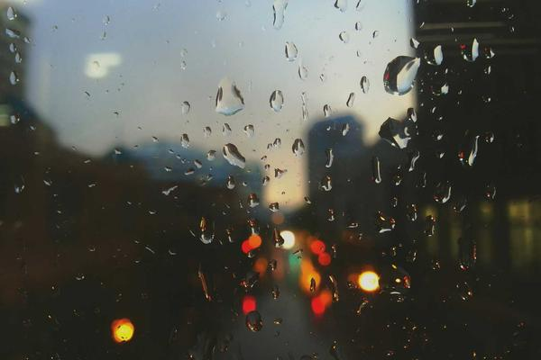

# London Fog and Gaslight: Everyday Life in Victorian Britain

> **Category:** Essay | **Words:** ~700  
> **Cover:** 

---

The Victorian era was not one world but two, and the two occupied the same streets. The first was the world of the Great Exhibition of 1851, housed in Joseph Paxton's Crystal Palace — a shimmering cathedral of glass and iron that seemed to announce the arrival of a new age of progress and prosperity. The second was the world of the East End slums, where families of eight slept in single rooms and the Thames carried the city's sewage to the sea in slow, visible currents of brown.

Victoria reigned from 1837 to 1901 — sixty-four years that transformed Britain more radically than any comparable period before or since. At the start of her reign, most Britons lived in the countryside and worked the land. By its end, Britain was the world's first predominantly urban society, with industrial cities like Manchester, Birmingham, and Glasgow swollen beyond recognition. The railway had shrunk the nation: journeys that once took days now took hours. The telegraph, and later the telephone, collapsed distance entirely.

For the middle and upper classes, this was an age of extraordinary domestic comfort. Gas lighting replaced candles; indoor plumbing replaced the outhouse; railways brought fresh food from the countryside to urban markets. The home became a moral project — the Victorians invented the modern idea of childhood, of family privacy, of the parlor as a sacred space where the harsh world outside was kept at bay. Christmas as we know it — the tree, the cards, the family gathering — is a Victorian invention, popularized by Prince Albert and immortalized by Charles Dickens.

But the comfort of the few rested on the labor of the many. Factory workers — including children as young as six — worked twelve- and fourteen-hour days in conditions that shortened life expectancy by decades. The novelist Elizabeth Gaskell wrote of Manchester mill workers who had never seen the countryside, who lived and died within a few streets, whose lungs were permanently dyed by the cotton fibers they breathed. The great social reform movements of the era — the Factory Acts, the abolition of child labor, the rise of trade unions — were born from the tension between Victorian prosperity and Victorian misery.

Dickens captured this duality better than any historian. His novels are a catalogue of Victorian extremes: Miss Havisham's rotting wedding feast and Oliver Twist's empty bowl, Scrooge's counting house and the Cratchit family's modest goose. He showed his readers that the two worlds — rich and poor, bright and dark — were not separate. They were the same city, the same era, the same story.

The Victorian age ended with Victoria's death in 1901, but its architecture still defines Britain's cities, its railways still carry its passengers, and its moral debates — about inequality, about technology, about what we owe to one another — remain unsettled.

---

*Cover image: Victorian architecture standing proud against time.*
