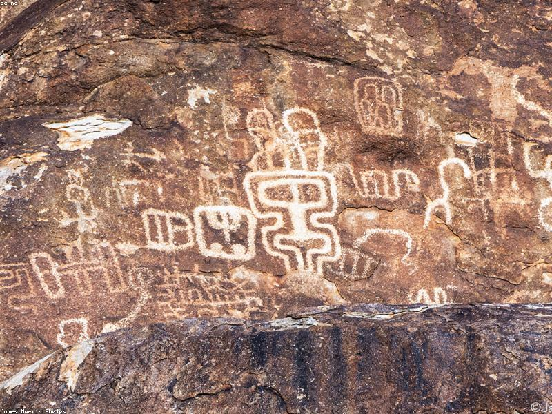

# Hadrian's Wall: Empire's Northern Edge

> **Category:** Historical Introduction | **Words:** ~550
> **Cover:** 

---

In the year 122 CE, the Roman Emperor Hadrian visited Britain and ordered the construction of a wall. Not a modest wall — a coast-to-coast fortification stretching eighty Roman miles (seventy-three modern miles) across the narrow neck of northern England, from the River Tyne in the east to the Solway Firth in the west. It took three legions roughly six years to build, and when it was finished, it was the most heavily fortified border in the Roman Empire.

Why build it? The traditional answer — that Hadrian's Wall was designed to keep the "barbarian" Picts out of Roman Britain — is only partly true. Walls are statements as much as defenses. Hadrian, unlike his expansionist predecessor Trajan, believed in consolidation over conquest. The wall was a declaration: here Rome ends. It was also a control point. Gates were built at regular intervals — not to block passage, but to regulate it, to tax it, to observe it. The wall was less a barrier than a membrane, selectively permeable, designed to manage the flow of people and goods between two worlds.

The engineering was extraordinary. The wall itself was initially planned as ten Roman feet wide and up to twenty feet high, built of stone in the east and turf in the west where stone was scarce. In front of it ran a deep ditch; behind it, a military road for rapid troop movement. Every Roman mile, a fortified gateway called a milecastle housed a small garrison. Between each pair of milecastles, two watchtowers provided surveillance. And behind the wall, a series of large forts — Housesteads, Vindolanda, Chesters — housed the thousands of auxiliary soldiers who manned this northern frontier.

Life on the wall was not the grim, isolated posting of popular imagination. The Vindolanda tablets — thin wooden leaves inscribed with ink, preserved in anaerobic bog conditions — reveal a garrison community of surprising domesticity. Soldiers wrote home for socks and underwear. A commander's wife invited a friend to her birthday party. Merchants sold goods to soldiers with disposable income. The wall was a city stretched thin across a landscape, a linear community of perhaps ten thousand people from across the empire — Syrians, Gauls, Batavians, and Dacians — all stationed at the edge of the known world.

The Romans abandoned the wall in the early fifth century as the empire crumbled. Local communities quarried its stones for churches and farmhouses. But it never fully disappeared from the landscape or the imagination. George R.R. Martin has cited it as inspiration for the Wall in *Game of Thrones* — though Hadrian's version had fewer ice zombies. Today, it is a UNESCO World Heritage site, and you can walk its length along the Hadrian's Wall Path, following the footsteps of soldiers who guarded an empire's edge nearly two thousand years ago.

---

*Cover image: Stone and sky — Rome's final frontier.*
