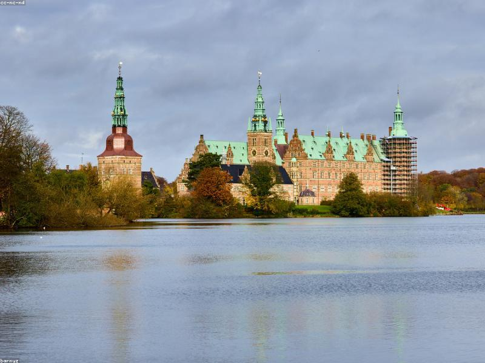

# Magna Carta: The Accidental Constitution

> **Category:** Historical Introduction | **Words:** ~550
> **Cover:** 

---

On June 15, 1215, in a meadow called Runnymede beside the River Thames, King John of England put his seal to a document he had no intention of honoring. He was being forced — by a coalition of rebellious barons who had captured London and threatened his crown — to grant a charter of liberties. The document, later known as Magna Carta (the "Great Charter"), was annulled by the Pope within ten weeks and plunged England into civil war. John died the following year of dysentery. The charter, by any reasonable measure, was a failure.

And yet, eight centuries later, Magna Carta is revered as one of the foundational documents of constitutional government. Its most famous clause — "No free man shall be seized or imprisoned... except by the lawful judgment of his equals or by the law of the land" — is a direct ancestor of the right to trial by jury and the concept of due process. How did a failed peace treaty between a despised king and his rebellious barons become a cornerstone of Western liberty?

The answer lies in what happened after John's death. The charter was reissued — in modified form — by the regency government of John's young son, Henry III, in 1216 and again in 1217 and 1225. Each reissue embedded it deeper into English law. By the time of Edward I in 1297, Magna Carta had been formally entered onto the statute rolls. What began as a specific list of baronial grievances — about inheritance taxes, widow remarriage, and fish weirs on the Thames — had been transformed into a general statement of the principle that the king himself was subject to the law.

Most of Magna Carta's original clauses are long obsolete. (Clause 33, demanding the removal of all fish weirs from English rivers, has limited modern relevance.) But the principle it established — that power must be exercised within a framework of law, not arbitrary will — has proved remarkably durable. The American revolutionaries cited it. Nelson Mandela invoked it at his trial. The Universal Declaration of Human Rights echoes it.

Magna Carta was not democratic in any modern sense. It was a charter for the baronial elite, not the common people. But it planted a seed that grew far beyond the intentions of its authors — the idea that government derives its legitimacy not from divine right or raw force, but from consent and law.

---

*Cover image: The meadow at Runnymede — where a failed peace treaty became an immortal principle.*
