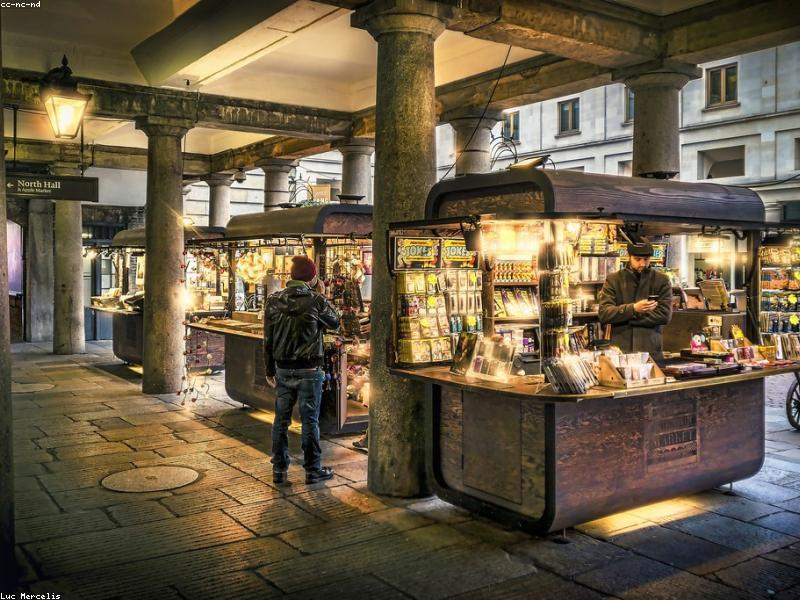

# The Blitz: London Under Fire

> **Category:** Historical Narrative | **Words:** ~600
> **Cover:** 

---

At 4:56 p.m. on September 7, 1940, the first wave of German bombers appeared over the London docks. By the time the all-clear sounded the next morning, 436 Londoners were dead and the East End was in flames. It was the beginning of the Blitz — fifty-seven consecutive nights of aerial bombardment that would kill more than 40,000 British civilians and reshape the physical and psychological landscape of the nation.

The Blitz was Hitler's attempt to bomb Britain into submission after the Luftwaffe failed to destroy the Royal Air Force in the Battle of Britain. The strategy was simple and brutal: terrorize the civilian population until morale collapsed and the government sued for peace. It did not work. Instead, the bombing produced the opposite of its intended effect — a fierce, defiant solidarity that Churchill called "the spirit of the Blitz."

That spirit was real, but it was also carefully curated. The Ministry of Information controlled the narrative, suppressing photographs that showed panic or chaos and amplifying images of stoic resilience — the milkman delivering bottles through rubble, the King and Queen visiting bombed-out streets in tailored coats. The famous "London Can Take It" propaganda film, released in October 1940, was aimed as much at American audiences as British ones, making the case for U.S. intervention by showing a plucky island nation standing alone against tyranny.

The reality on the ground was messier. The Tube stations, which the government initially forbade as shelters, became vast underground dormitories — by late September, an estimated 177,000 Londoners were sleeping in the Underground every night. Crime spiked. Looting of bombed houses became common enough that the government made it a hanging offense. Racial tensions flared in neighborhoods where bombs fell indiscriminately on rich and poor, black and white. The Blitz did not erase class divisions; it exposed them, often brutally. The East End, with its docks and warehouses, took far more bombs than the wealthy West End, and its residents knew it.

The bombing continued, on and off, until May 1941, when Hitler turned his attention eastward toward the Soviet Union. London had lost over a million buildings damaged or destroyed. But it had not broken. The Blitz became central to British national mythology — a story of ordinary people enduring extraordinary violence with courage and dark humor. The mythology was not entirely true, but it was not entirely false either. The people of London really did keep going to work, queuing for buses, and making tea in the rubble. History's verdict, for once, aligns with the propaganda: London could take it, and did.

---

*Cover image: The dome of St Paul's rising above smoke and fire — defiance made visible.*
